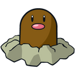
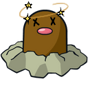
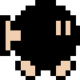
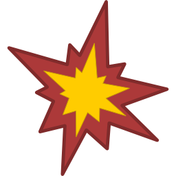
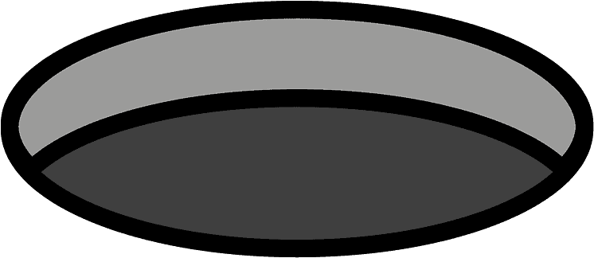
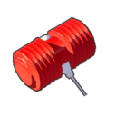
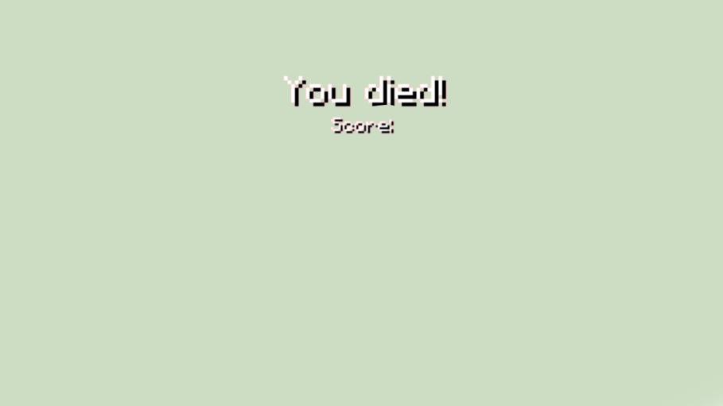
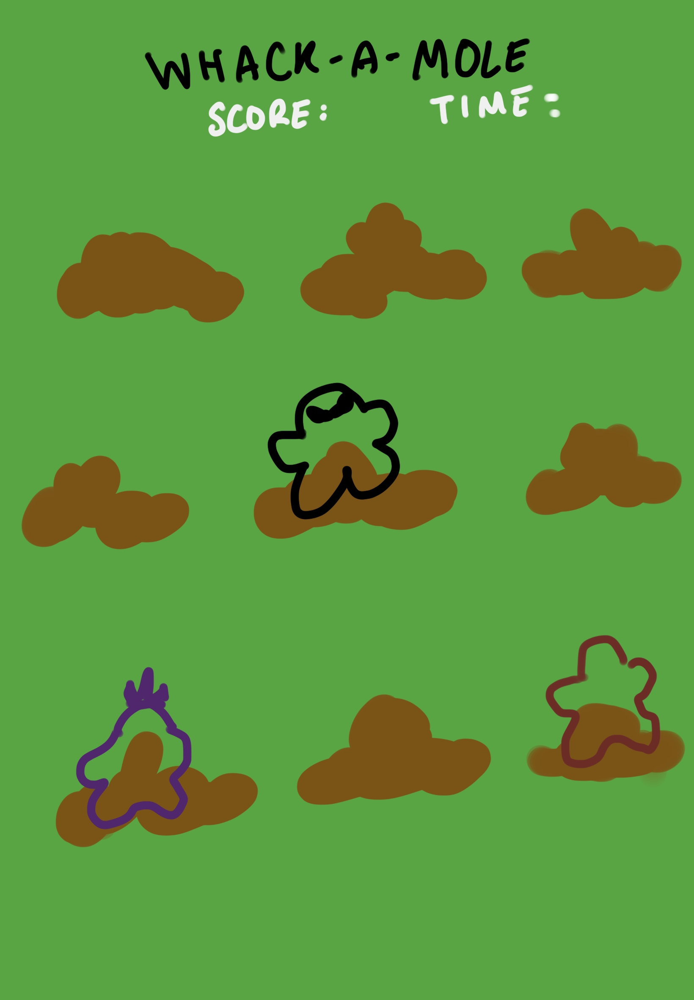
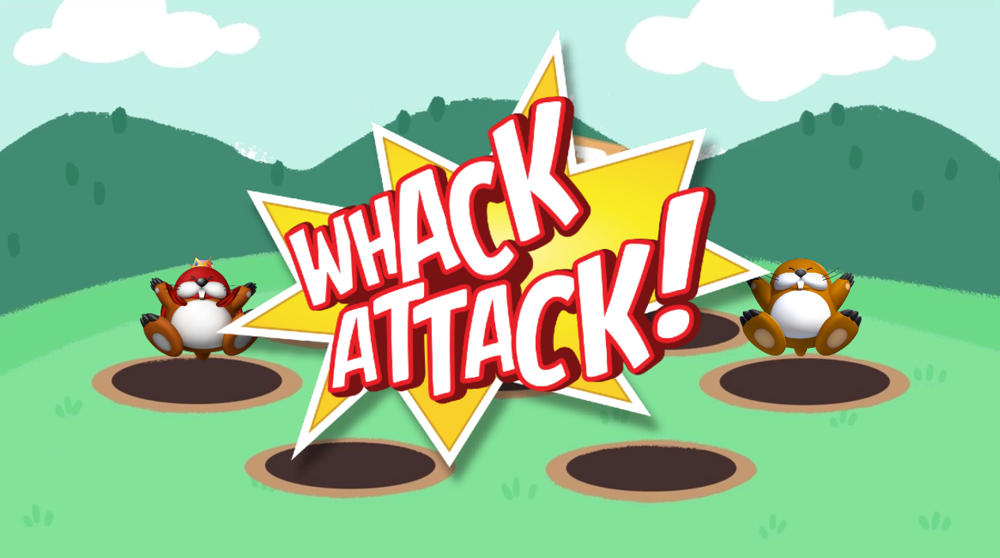

:warning: Everything between << >> needs to be replaced (remove << >> after replacing)
# CS110 Project Proposal
#  Whack-A-Diglett
## CS 110 Final Project
### Spring Semester, 2022 
### [Assignment Description]

[https://docs.google.com/document/d/17qiZWoMwS6zSRvudSRDmF6hJhJLj_s3nkh4DuxMlsgI/edit?usp=sharing](#)

Repl Link

[https://replit.com/join/vwbxolmhvy-maggielam2](#) 

GitHub URL

[https://github.com/bucs110a0spring22/final-project-byte-panache.git](#)

Demo Slides

[https://docs.google.com/presentation/d/1rkXqb2LRCy1dBhO1xnJrhbHrU_OUvrY93ZE1MePuGB8/edit?usp=sharing](#) 

Demo Video in etc folder

### Team: Team 7
#### Maggie Lam, Nashara Marrow, Joseph Pena

***

## Project Description *(Software Lead)*

 Our final project will be based on the arcade game whack-a-mole. The user will be using their mouse to hit different moles in a set time span. This game will feature moles and bombs. The player will have 3 lives, and will die after touching a bomb 3 times.  

***    

## User Interface Design *(Front End Specialist)*

#### Interface Description
 * For the visual aspect of this project, there will the title at the top middle of the screen, with the scoreboard and the lives right under it. There will be 9 holes in the middle of the screen (3 x 3). During the gaming process, a mole or a bomb will come out of the hole. There will be a limited amount of time where the mole/bomb will be on the screen. When hit, the mole/bomb transition into an injured/exploded state. The only interactive(clickable) elements in this game is the mole and the bomb. The cursor is a mallet image, this is for aesthetic purposes since the game is referenced from Whack-A-Mole. When too many bombs are hit, the game moves into the death state, triggering the death screen. Which the final score of the player will be revealed on the middle of the screen.

#### Interface Elements 
  * Gameplay Interface 
      * Mole
        * Clickable mole that the user has to hit to gain a point. It is an image of a diglett from mario. 
          
      * Mole Hit
        * Once the user clicks the mole, it automatically changes into the MoleHit state/frame. Used for aesthetic reasons mainly. Also allows user to know if they clicked the mole besides the point increase.
        * 
      * Bomb
        * Clickable bomb that the user should be actively avoiding to not lose a life. Image is from mario bros 3, as one of the bom-ombs. 
         
      * Bomb Exploded
        * frame after the bomb is hit. Used for aesthetic reasons to let the user know that the element has been clicked.
          
      * Hole
        * Holes that are places onto the ground. Allows the user to know where the holes or the bombs will be coming out of. There will be exactly nine of these on the screen. The mole/bomb pos out of these holes
        
      * Hammer
        * This is the image for the cursor. Since the game is Whack-A-Mole, it is fitting for the user to be hitting the moles with a hammer. The image is a squeeky mallet, since I thoought a real realistic hammer would be too graphic 
         
      * BACKGROUND
        * There is no specific background used. pygame has a function that allows us to fill the screen green, meant to represent grass. RGB colors are - (43, 92, 44)
    * Death Screen
      * The death screen is a photo of the lose screen from minecraft. This is useful to let the user know they lost the game as well as their final score. Death screen is from minecraft, very iconic death screen. The score will be shown in the center of the screen
       

#### Test the Features
These features can be seen by running the game and clicking on the mole and the bomb. If you want to test the Death Screen, you should purposely click the bomb 3 times. 

#### Original GUI concept
The original GUI design didn't stray that much from the final product besides the extra mole characters. The extra point moles were just replaced with the bombs so the player would be able to lose the game.
* Mole (1 point)
  
  * original GUI was going to feature monty mole instead of diglett. It looks like its jumping, so it can appear that its jumping out of the hole in the game
* Mole (3 point)
   
  * secondary mole that was going to be used instead of final bomb idea. Was going to give 3 points instead of 1. 
* mole (5 point)
   
  * third mole that was gonna give the most points instead of the bombs. This is the final mole that was suppose to give the most amount of points. I was originally going to make it so this mole appears more often
#### Original GUI drawing
 
* The original design had dirt has the holes instead of the cartoon holes we have featured. It also has the 3 previous moles shown. There was originally no death screen since the moles could go up indefinitely. 
  
* Instead there was gonna be start screen to replace the death screen. However we decided that wasn't necessary for the game once the bombs were implemented into the game. 

  
  

#### Additional Libaries/Modules used
  * Pygame
    * https://www.pygame.org/docs/
    * Is used to make a game functions. Gives many of the repl's game mechanics. 
  * Time
    * https://docs.python.org/3/library/time.html
    * This module is useful to keep track of time. 
  * Thread
    * https://docs.python.org/3/library/threading.html
    * Allows the user to run multiple programs at the same time.
  * Sys
    * https://docs.python.org/3/library/sys.html
    * This library gives access to some variables not in python.
  * Random
    * https://docs.python.org/3/library/random.html
    * The Random library can generate a randomized list of pseudo numbers.
    

***        

## Program Design *(Backend Specialist)*
* Non-Standard libraries
    * System-specific parameters and functions
        * https://docs.python.org/3/library/sys.html
        * Provides access to some variables used or maintained by the interpreter and to functions that interact strongly with the interpreter.
    * Pygame
        * https://www.pygame.org/wiki/about
        * Provides a set of Python modules designed for writing videogames.  
    * Random
        * https://docs.python.org/3/library/random.html
        * Random module generates pseudo-random numbers.
    * Thread (non-standard)
      * https://docs.python.org/3/library/threading.html
      * Splits the code into 2 tasks running at the same time.
    * Time
      * https://docs.python.org/3/library/time.html
      * Provides various time-related functions. Used to set time sleep.

* Class Interface Design
  
* Classes
    * Controller - runs the main function of the code. Sets up the hole and spawns the moles and bombs
    * Models - initializes the mole and the hole. Makes the update function for what happens when the mole is clicked or missed. Returns the rect coordinatees of the holes.
    * Utility - has all the constants used for the whole code.

## Project Structure *(Software Lead)* Nashara Marrow 

The Project is broken down into the following file structure:

* main.py
  * stores all of the functions that are being called , wed everything together to ensure that the program works when being paayed byt the user. The main py is essential to the inner working of our games and ultimatley makes sure that every aspect of the game is working consectutively. 
* src
    * controller.py -> initializes all the variables needed for the repl. Generates the mole and the bomb and changes the state depending on screen interaction. Sets the points and the lives function. Calls the modules and the utilities class. has the gameloop, the menuloop, and the exitloop. 
    * model.py -> The model, intalizes the moles while also keeping track of all the places that the holes are , in a way this ensures that everything is stored in one place which makes it easy to change the places when need be. 
    * utility -> Houses all the constants needed for the game to work properly. Gives a value to a certain name and keeps everything in one place so that the variables are universal ad note local , can be imported into different places.
* assets
  * These are all pictures that are needed for the game , it houses the mole , pictures before and after it is hit , the hammer and holes , the ending game screen. 
    * Mole anims , class_diagram , death screen , foldercontent , hammer , hole 
* etc
    * Original GUI , Start screen, demo video -> 
    * This holds all the data that goes into creating the game , basically the blueprint of the game , before we actully created it and the end results , after we finished it. It shows the outline of the overall game and what went into makeing the game and what it lookied like when it was finally created.

***

## Tasks and Responsibilities *(Software Lead)*

   * You must outline the team member roles and who was responsible for each class/method, both individual and collaborative.

### Software Lead -  Nashara Marrow 

I made sure that everyone was on top of everything that they had to do while also figuring ways to test the code. I also created a testing portion in our code that tested all of the classes to see if they worked properly.

### Front End Specialist - Maggie Lam 

 I created the controller class, making the mole/bombs and all the functions/methods within it. I also created the models and utility making the updates methods and the constants. I also decided what images should be on the screen, i.e. the mole, hole, bomb, etc.

### Back End Specialist -  Joseph Pena 

I helped the front end specialist with the intial design and classes overview. I also helped visualize the class diagram to portray what each class provided for the controller and what instance variables, methods, and responsibilities they upheld. 

## Testing *(Software Lead)* Nashara Marrow 

*  We basically used a mathematical system in order to place the holes in columns so we knew exactly where everything was. We also created a testing py which made sure that everyhting ran properly withing the main py and the ther parts with in the code, while also actively testing the code to spot the errors we missed.   
    * << A function that returns the coordinates of the wholes  >>

## ATP

| Step                  | Procedure     | Expected Results  | Actual Results |
| ----------------------|:-------------:| -----------------:| ------------
|   1    |   Within game, click on mole when one pops up, adding to score on the top left    |   The hammer interacts with the mole, leaving it in a hurt state. The score to the top left should increase by 100 everytime this event occurs.   | Hammer interacts with mole, which is left in hurt state. The score in the top left gains an additional 100 points.
|   2    |   Allow mole to enter hurt state, causing mole to be stunned    |   The mole changes from its regular image to a hurt one.    | Mole changes into hurt state, image also changes along with it.
|   3    |    Player loses life when pressing on a bomb  |   The amount of lives on the top right of the screen should decrease by 1 after the hammer interacts with a bomb.   | Lives go down by 1 each time a bomb is hit. Bomb looks like it explodes.
|   4    |   Game over screen shows up when lives are gone    |   Gamer over screen begins, when the player has interacted with 3 bombs with the hammer.   | Score is in the center of the screen in black. Death screen is executed.