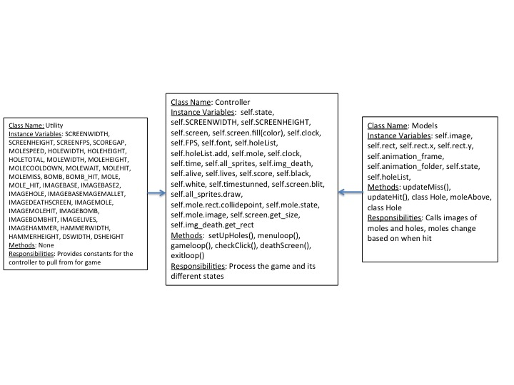

:warning: Everything between << >> needs to be replaced (remove << >> after replacing)
# CS110 Project Proposal
#  Whack-A-Mole 
## CS 110 Final Project
### Spring Semester, 2022 
### [Assignment Description](https://docs.google.com/document/d/17qiZWoMwS6zSRvudSRDmF6hJhJLj_s3nkh4DuxMlsgI/edit?usp=sharing)

<< [repl](#) >>

<< [https://docs.google.com/presentation/d/1rkXqb2LRCy1dBhO1xnJrhbHrU_OUvrY93ZE1MePuGB8/edit?usp=sharing](#) >>

### Team: << team name >>
#### Maggie Lam, Nashara Marrow, Joseph Pena

***

## Project Description *(Software Lead)*

<< Our final project will be based on the arcade game whack-a-mole. The user will be using their mouse to hit different moles in a set time span. This game will feature moles and bombs. The player will have 3 lives, and will die after touching a bomb 3 times.  >>

***    

## User Interface Design *(Front End Specialist)*

***Milestone II***
* << In our project their will be a staring game button when you click you will enter a wack a mole game where there will be different variations of moles that go faster and slower , in addition to these moles there will be a bombs that make the player lose points , score will be kept on screen and after the time runs out the game will be over. The classes needed are a character class , time class , a class for keeping score and a class that changes the moles speed once the time gets to a certain point with in the game.  >>
  * time : time function, decrease for rounds(depends on amount of rounds)
  * moles : randomizing mole function, sprite, rectangular hit box, similar code for all three moles except for the amount of points and time it takes to spawn.
  * points : takes information from the moles.py, should have an if else statement depending if a mole or bomb is touched. points have to be written on the screen
  * bombs : Similar code to moles.py
  * rounds : speed python function
* << You should also have a screenshot of each screen for your final GUI >>

***        

## Program Design *(Backend Specialist)*

* Non-Standard libraries
    * << You should have a list of any additional libraries or modules used (pygame, request) beyond non-standard python. >>
    * For each additional module you should include
        * url for the module documentation
        * a short description of the module
* Class Interface Design
    * << A simple drawing that shows the class relationships in your code (see below for an example). >>
        * 
    * This does not need to be overly detailed, but should show how your code fits into the Model/View/Controller paradigm.
* Classes
    * Moles - A class that defines an object that the player needs to interact with...
    * Bombs - A class that defines an obstacle that the player needs to avoid...
    * Extra Point Mole - A class that defines an object that the player needs to interact with...
    * Fast Mole - A class that defines an object that the player needs to interact with...

## Project Structure *(Software Lead)*

The Project is broken down into the following file structure:

* main.py
* src
    * <all of your python files should go here>
* assets
    * <all of your media, i.e. images, font files, etc, should go here)
* etc
    * <This is a catch all folder for things that are not part of your project, but you want to keep with your project. Your demo video should go here.>

***

## Tasks and Responsibilities *(Software Lead)*

   * You must outline the team member roles and who was responsible for each class/method, both individual and collaborative.

### Software Lead - << Nashara M >>

<< Worked as integration specialist by... >>

### Front End Specialist - <<Maggie Lam >>

< I created the controller class, making the mole/bombs and all the loops. I also had a hand in the models and constants class making the updates and constants >

### Back End Specialist - << Joseph P >>

<< The back end specialist... >>

## Testing *(Software Lead)*

* << Describe your testing strategy for your project. >>
    * << Example >>

## ATP

| Step                  | Procedure     | Expected Results  | Actual Results |
| ----------------------|:-------------:| -----------------:| -------------- |
|  1  | Run Counter Program  | GUI window appears with count = 0  |          |
|  2  | click count button  | display changes to count = 1 |                 |
etc...
|   3    |       |      |
